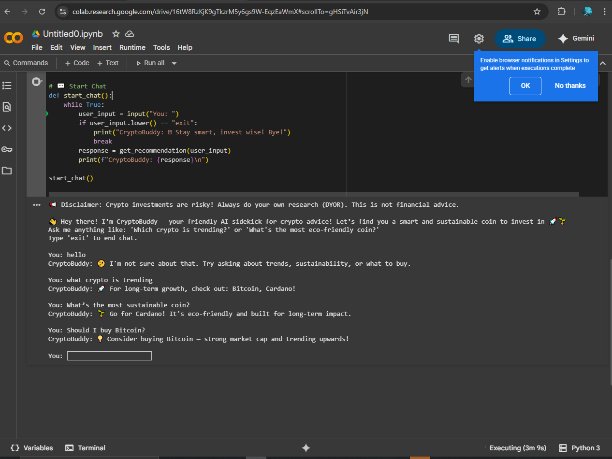

This is a simple rule-based crypto advisor chatbot using Python logic. It answers queries based on a predefined dataset.
Chatbot Summary

**How does this chatbot mimic basic AI decision-making?**

CryptoBuddy uses rule-based logic to mimic AI decision-making. It analyzes crypto trends and sustainability from a small dataset and gives personalized advice. Though it’s not real AI or live data, it simulates how basic decisions can be automated using if-else conditions, making it great for beginners.

